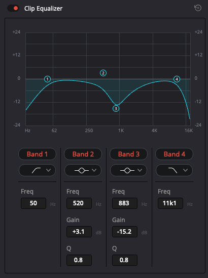

# Techdemo

개발된 소프트웨어 소개를 위한 영상 제작 가이드 문서입니다.

### 순서
- 기획
- 대사 작성
- 촬영
- 목소리 녹음
- 편집
- 사운드 선택 및 구매
- 아웃풋

### 사용 툴
- 다빈치 리졸브

### 아웃풋
- 코덱: Apple Prores422HQ
- FPS: 24
- 사이즈: 1920x1080

### 마우스 포인터 설정

- 시스템 환경설정 > 손쉬운 사용 > 디스플레이 클릭 > 커서 2단계만 돌린다.

### 스크린샷
- macOS에서는 간단하게 Command + Shift + 5 를 눌러서 선택영역으로 스크린샷을 할 수 있습니다.
- 깔끔한 결과를 위해 데모시에 하단의 Dock을 가릴 것
- 웹 어플리케이션 서버를 데모할 때는 깔끔한 결과를 위해 크롬브라우저를 사용하고 전체화면 모드로 촬영할 것

### 컬러챠트 촬영
다빈치 리졸브는 컬러챠트를 이용해서 촬영당시의 컬러를 재연할 수 있습니다.

### 타이틀 트렌지션

### 하단 트렌지션
하단 보조 타이틀의 배경색을 검정으로 셋팅해 줍니다.

### 보안
- 모자이크 효과: https://www.youtube.com/watch?v=n66tfmw1JCs

### 목소리 에디팅
까슬까슬한 목소리의 중음을 조금 다듬어줍니다.

### 사운드 구매
- https://artlist.io
- https://www.epidemicsound.com
- https://www.premiumbeat.com
